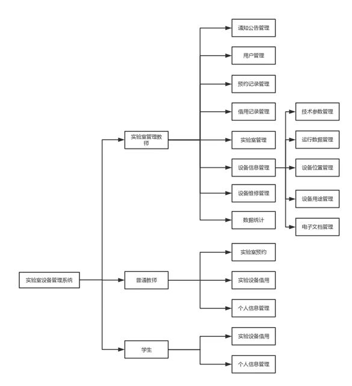
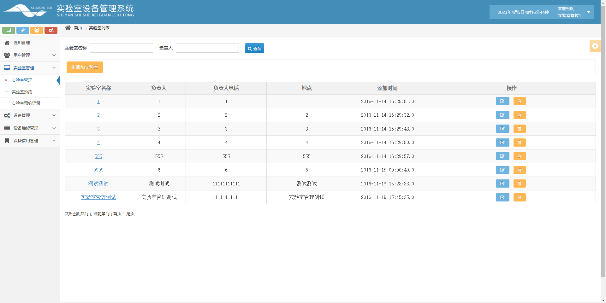
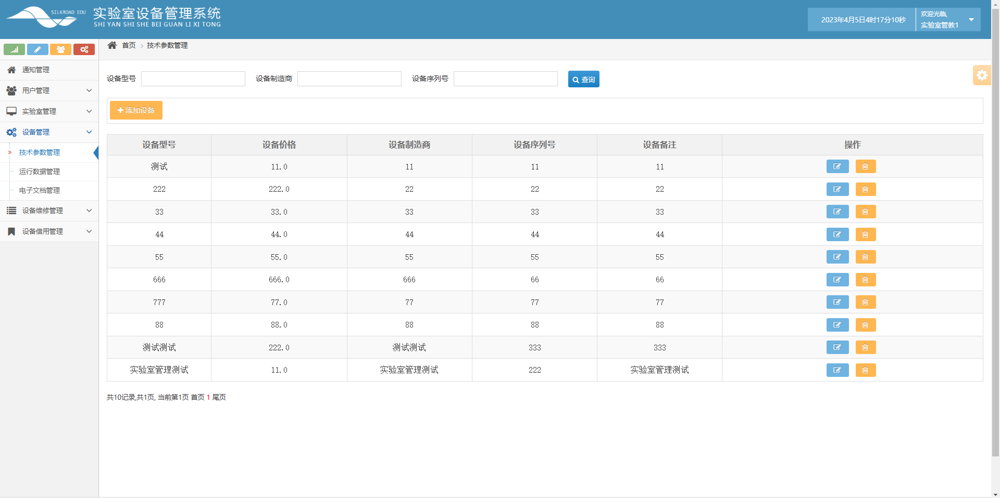
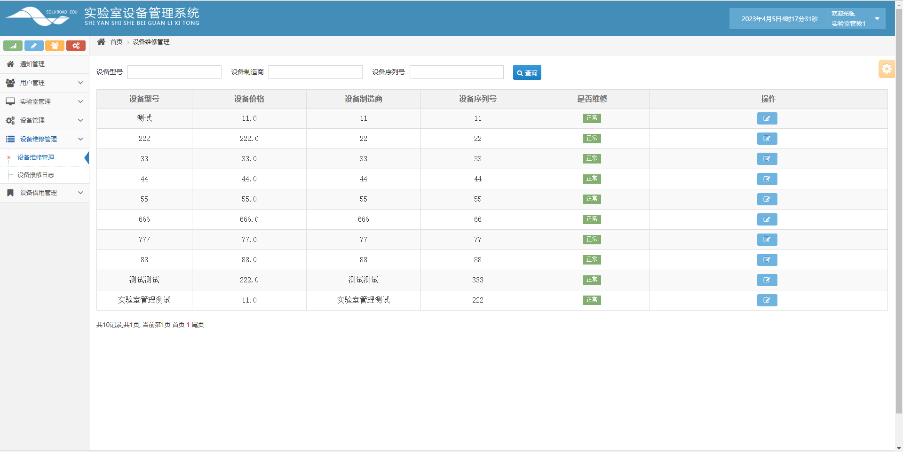
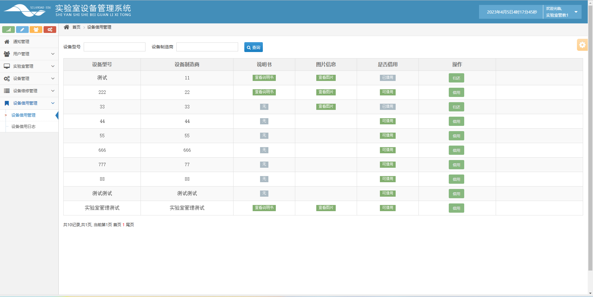

# 实验室设备管理系统

## 一、介绍

基于spring+hibernate+struts2+jsp+jquery的实验室设备管理系统

开发语言：java

运行环境:idea或eclipse 数据库:mysql

系统分为三个角色：管理员、教师、学生，各角色功能模块如下：

1、管理员：通知管理、用户列表、实验室管理、实验室预约、实验室预约记录、设备管理、运行数据管理、电子文档管理、设备维修管理、设备保修日志、设备借用管理、设备借用日志

2、教师：通知管理、用户管理、实验室预约、设备借用管理

3、教师：通知管理、用户管理、设备借用管理

## 二、系统功能部分页面展示

## 三、 9.9￥ 获取完整源码+sql，附赠1600字项目文档参考，需要加Q：3808981644 备用Q：3577148218

